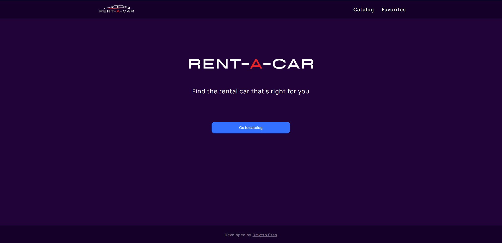
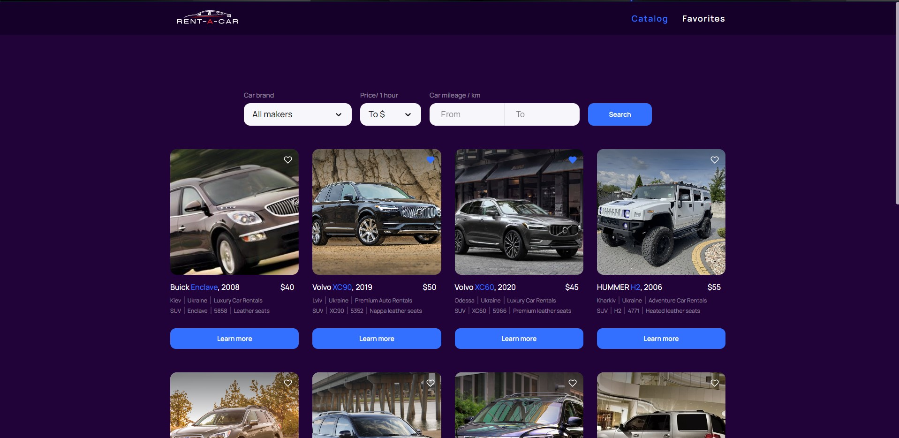
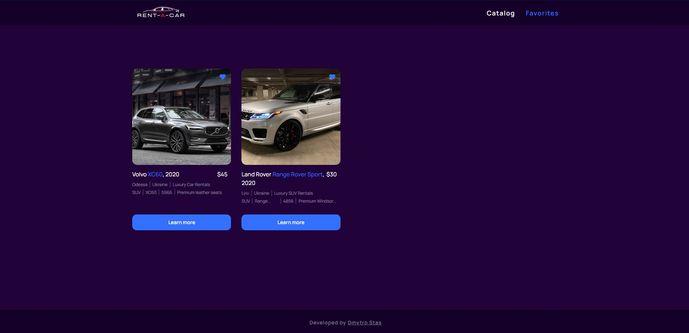
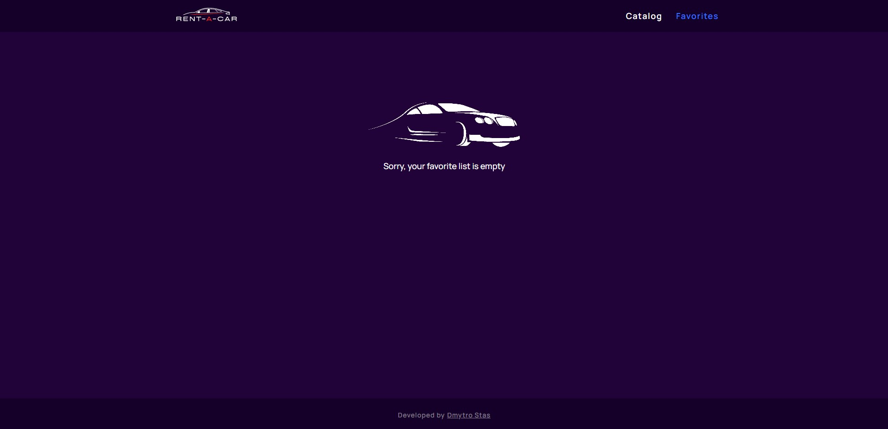
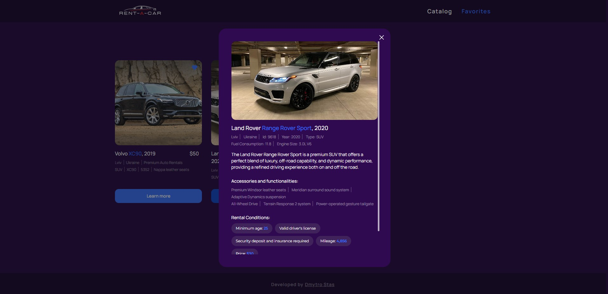

# RENT-A-CAR application

Test task project

**Technology stack** - [React, JS, CSS modules, Redux, Axios, REST API]

**Feature** - Adaptive design

API Requests are made to the mockapi.io service, where a mini back-end has been
deployed for this project.

## About

RENT-A-CAR is an application for people who are looking for a rental car.

This user-friendly app, designed to be convenient in mind, offers a seamless and
enjoyable experience for renting the perfect vehicle for your needs.

## Overwiev

The base URL address of the application always welcomes users.

Catalog page where you can view the entire list of available cars for rent. It
is also possible to filter the list by several parameters.

The Favorites page is a place filled by the user himself. If the list is empty,
the app will let the user know about it, but if not, the user can always see
their favorite cars.

A modal window opens when you click on the Learn more about car button. It
allows users to see detailed information about the car.

##

> Developed by [**Aleksander Porakh**](https://www.linkedin.com/in/aliaksandr-porakh-34ba96235/)

fwf